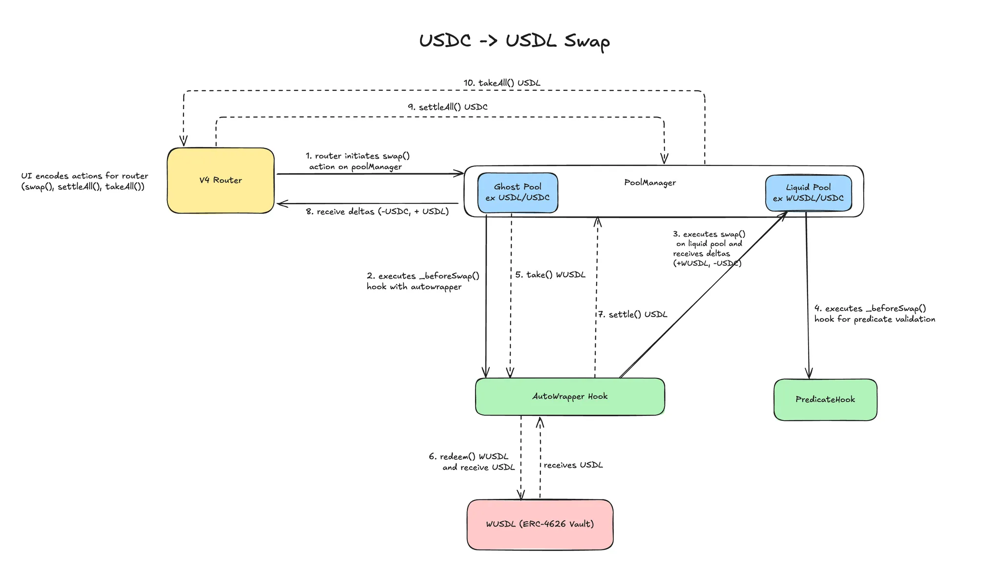

# USDL Uniswap V4 Hooks

## Overview

This repository has a collection of smart contracts that enable policy-controlled trading of USDL (Lift Dollar) on Uniswap V4. It includes two V4 hooks - AutoWrapper Hook and Predicate Hook. AutoWrapper hook manages USDL conversions and swapping through liquid pool. Predicate hook enforces the policy/compliance requirement for all swaps.

## Key Features

- Policy-controlled trading of USDL/wUSDL pairs
- Automated token wrapping between USDL and wUSDL
- Configurable compliance requirements enforced on-chain
- Flexible ownership and policy management (Both hooks are Ownable2Step)
- Support for transaction limits, geo-restrictions and other controls
- By default, it has support for trading with any USDL/ERC20 pair. Example is with USDC

You can find the design doc [here](https://predicate-network.notion.site/Design-Doc-Paxos-Uniswap-V4-Hooks-1e3d742b36ac80968d5df0282292e1ba?pvs=74)

## Architecture



### Components

- **V4Router**: Handles swap routing (barebone UniversalRouter implementation)
- **Pools (configured with scripts)**:
   - Ghost Pool (USDL/ERC20)
   - Liquid Pool (wUSDL/ERC20)
- **Hooks**:
   - PredicateHook: Validates compliance through signed Predicate messages
   - AutoWrapper: Manages USDL conversion and routing between pools
- **Transactor**:
   - Used for e2e testing with predicate network staging API

## Policy
Policies are JSON objects stored onchain and evaluated by Predicate Operators offchain. Each policy contains a set of 
rules—such as AML checks, geofencing, or other criteria—which must be satisfied for a transaction to be authorized.

Policy docs [here](https://docs.predicate.io/essentials/introduction).

## Deployment

### Prerequisites
- Foundry
- An Ethereum node provider (e.g. Alchemy, Infura, etc.)
- An account with 50 USDL, 50 wUSDL, 50 USDC on Ethereum is required for local development against an Ethereum Mainnet fork 

### Setup

```bash
# Install dependencies
make install

# Build contracts
make build

# Run tests
make tests
```

## Local Development
For local development, it is recommended to run an anvil fork for mainnet. Alternatively, there's `DeployTokensAndPool.s.sol` to deploy PoolManager, PositionManager etc.

To run a mainnet anvil fork: 
```
anvil --fork-url <MAINNET_URL> --fork-block-number 22197233
```

For testing with mainnet anvil fork:

**Makefile updates**
- Verify `NETWORK=MAINNET` in Makefile. This enables our network selector in script to use mainnet addresses for tokens, poolmanager etc. 
- Update ENV variable for `DEPLOYER_ECDSA_PRIV_KEY` to the key that has USDL, wUSDL and USDC on mainnet (this is not consumed in testing as we are running local fork but is required)

**Steps**
1. Run `make deploy-router` to deploy V4 router. 
2. Update `SWAP_ROUTER_ADDRESS` env variable in Makefile from this deployment
3. Run `make deploy-predicate-hook` to deploy standalone predicate hook contract. 
4. Update `PREDICATE_HOOK_ADDRESS` env variable in Makefile from this deployment
5. Run `make create-pool-and-mint-liquidity`. This deploys a V4 pool and mints necessary liquidity as well
6. Run `make deploy-auto-wrapper` to deploy auto wrapper and create ghost pool. 
7. Update `AUTO_WRAPPER_HOOK_ADDRESS` env variable in Makefile from this deployment
8. Run `make swap-usdc-for-usdl-exact-in`. This will swap USDC for USDL on the ghost + liquidity pools that we just configured. (there's some more options available in the script that can be used).

*Note: Predicate signature validation is skipped for local testing as the predicate hook owner is added to an authorized owner allow-list during hook creation.*

## Testing

### Unit Tests
```bash
make tests
```

